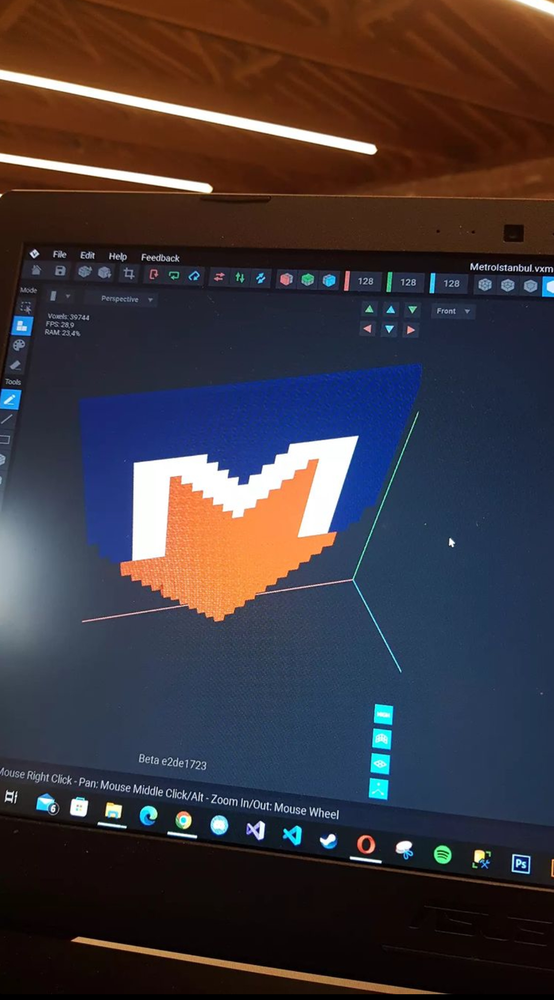
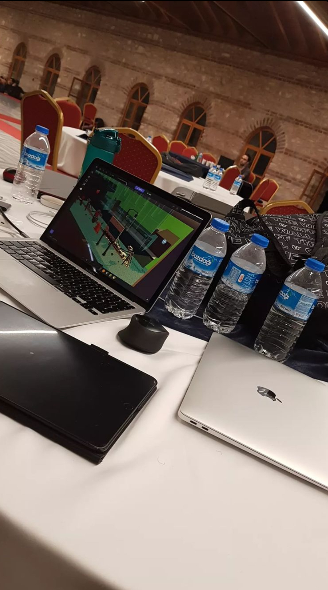
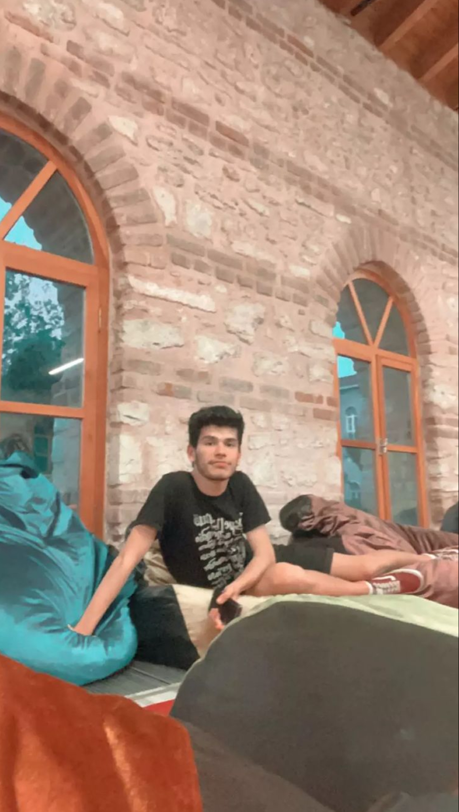
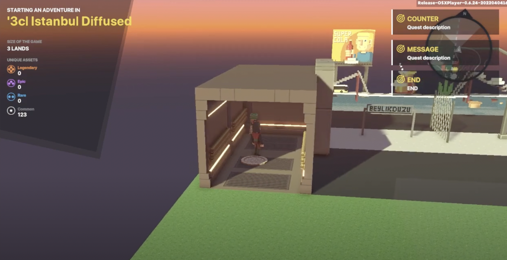

## The Sandbox - VoxJam Series Istanbul 
### June 29, 2022

  

In this blog post, I will talk about my experience in participating in the first edition of The Sandbox - VOXJAM Series Hackathon to represent ‘3cl, my start-up project and company. The Hackathon was organized between 26-27 June 2022 at Yildiz Technical University. Designing a metaverse-based game called "Istanbul Diffused" in a 48-hour time interval, our team qualified to the finals and ranked top 5 among 200 other teams. This was my first hackathon experience and I was incredibly proud that the efforts my team and I put into making an educative game was awarded by professional juries. I am incredibly happy to achieve this milestone, and to become one of the first developers of this universe. 

To start with, prior to this experience, my knowledge of game design was almost zero, however, thanks to its easy-to-grasp user interface and help from the mentors in the Hackathon, I learned a lot about designing a game. In particular, I accumulated an immense amount of knowledge regarding gamification using the metaverse. In the 48-hour interval, my team and I had to design a metaverse and voxel-based game using the Sandbox platform and we tried our best to accomplish this goal. Thanks to all the help from the mentors there, our knowledge was doubled. After all this hard work, we came up with an informative 2.5d game with an Istanbul-theme without getting any sleep. We had the oppurtunity to present our educative game to the sponsors of the hackathon, mostly consisting of professional jurors and renowable CEOs of various game development companies. In addition, I was able to talk and get advice from most of them. In the end, I was very glad to see that our game was very well received and supported. Few days later, my team and I even got a professional training offer in one of the sponsor companies. There, I have been developing my skills and creating different voxel art. 

My goal from now on is to reconcile what I know about educational technology, blockchain, and data science with game development. In future projects, I am planning to develop my start-up company in order to address the existing gap in most computer education programs and the recently-emerging sandbox technology. The next step is to work even further on our game "Istanbul Diffused" and publish it as the first educative game that aims to teach about the city Istanbul. Then, I am planning to find sponsors and scholarships to continue my game development series. 

Take a quick look into the game play of the game we came up with in the hackathon and contact me if you have any questions or comments! 

[Istanbul Diffused](https://www.youtube.com/watch?v=v2fdED9GbCU)

#sandbox #hackathon #startup #metaverse #voxelart #nft

## Why do people buy cryptocurrencies?

### January 30, 2022

People trade cryptocurrencies for a plethora of reasons in today’s digital technology world. To begin with, people can become a millionaire easily without any effort thanks to cryptocurrency. To illustrate, Yasin Aktimur helps people become millionaires by tweeting about different cryptocurrencies and informing his followers. These followers can get very rich thanks to his financial advice. Secondly, nowadays people can buy cryptocurrency because life is very hard because of wrong economics decisions by president of Turkish Republic. Because of this, people go to other currencies such as Ethereum, Bitcoin and other country currencies for earning a lot of money. As a result, people buy cryptocurrency and trade it for these reasons.  
